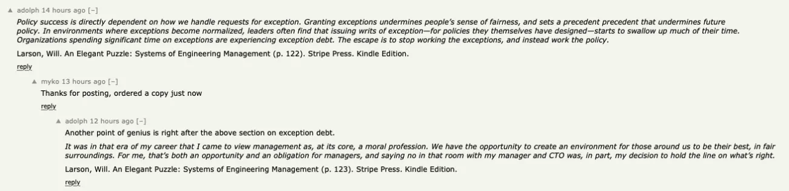

- Radical candour
- Actionable feedback
- Aspire to full transparency
- Exceptions and Doing What is Right
    

- Consider who your vision/motivation should be aligned with. Leaders and styles: stereotyping; marketing background leaders can create misalignment with technical staff with different communication styles and personalities