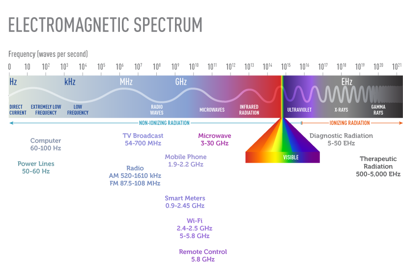
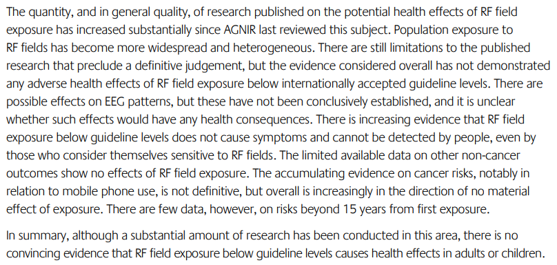

# Electromagnetic Radiation

## Motivation

- Is it bad to have a phone next to you all the time?
- Is it bad to have wifi and a thousand other waves going through you?
- Is it bad spending time near phone towers?
- What even is this stuff?
- Does it relate to skin cancer from the sun?

## Discovery

### What Is It?

> This section sourced from [Electromagnetic Fields and Cancer Fact Sheet](https://www.notion.so/Electro-Magnetic-Radiation-d71b403d8f3b4fc490059630778b12ea?pvs=21)
> 

**Electromagnetic Radiation** (**EMR**) comes from electromagnetic (electric and magnetic) fields (**EMFs**).

**EMFs** are invisible areas of energy (also called radiation) produced by electricity; commonly the movement of electrons or current through a wire. They also occur naturally (the Earth’s magnetic field).

**Electric fields**

- Produced by voltage (pressure pushing electrons through the wire).
- Always present whether devices are on or not.
- More voltage → stronger field.
- Easily shielded by walls/physical objects.

**Magnetic fields**

- Come from current flowing through wires or devices.
- Occurs when devices are on (constantly for power lines since current flows continuously).
- More current → stronger field.
- Not easily shielded, though strength decreases rapidly with distance.

EMFs are grouped by frequency, where higher frequency → more dangerous.

**Higher-frequency EMFs**

- Are in the [ionizing radiation](https://www.cancer.gov/Common/PopUps/popDefinition.aspx?id=CDR0000430698&version=Patient&language=English) part of the electromagnetic spectrum and can damage DNA or cells directly.
- Include [x-rays](https://www.cancer.gov/Common/PopUps/popDefinition.aspx?id=CDR0000045944&version=Patient&language=English) and [gamma rays](https://www.cancer.gov/Common/PopUps/popDefinition.aspx?id=CDR0000270730&version=Patient&language=English).
- Include UV rays from the sun (eg. sun → skin cancer)

**Low- to mid-frequency EMFs**

- Discussed in research as Extremely Low Frequency EMFs (**ELF-EMFs**) and radiofrequency EMFs (sometimes “radiofrequency radiation” or **RFR**).
- Are in the non-ionizing radiation part of the electromagnetic spectrum and are “not known to damage DNA or cells directly”.
- Include static fields (EMFs that do not vary with time), and fields from electric power lines and appliances, cell phone usage, Bluetooth & wireless devices, smart meters, Wi-Fi, radio waves, microwaves, infrared radiation, and infrared & visible light.

### What Is The Science Confident About?

- There is not, or there is limited evidence that exposure to EMFs is harmful for most people in normal circumstances (eg. within international guidelines).
    
    Radio and television signals:
    
    - There are [guideline limits in place](https://www.notion.so/Electro-Magnetic-Radiation-d71b403d8f3b4fc490059630778b12ea?pvs=21) to reduce exposure for maintenance workers and access to places where broadcasting antennas are placed ([source](https://www.notion.so/Electro-Magnetic-Radiation-d71b403d8f3b4fc490059630778b12ea?pvs=21))
        
        AM signals are transmitted from arrays of antennas that are placed at high elevation on sites that are off limits to the general public because exposures close to the source can be high ([source](https://www.notion.so/Electro-Magnetic-Radiation-d71b403d8f3b4fc490059630778b12ea?pvs=21))
        
    
    Microwaves:
    
    - Microwave ovens are manufactured with effective shielding that has reduced the leakage of radiofrequency radiation from these appliances to barely detectable levels ([source](https://www.notion.so/Electro-Magnetic-Radiation-d71b403d8f3b4fc490059630778b12ea?pvs=21))
    
    Wi-Fi:
    
    - Modern Wi-Fi routers will emit RFR at similar frequencies to mobile phones and also at 5GHz. You might be able to turn off the 5GHz setting on your router. Discussed further below.
        
        
    
    Cell phones:
    
    - Primary source for this subsection: [source](https://www.notion.so/Electro-Magnetic-Radiation-d71b403d8f3b4fc490059630778b12ea?pvs=21)
        
        Regular usage of cell phones has not shown significant risks over several decades. This is population level data and does not include detailed information about individual heavy users or the very recent massive increase in use post-smartphones & social media.
        
        A lot of the research in this area is outdated as it is concerned with phone calls. Many people use their cell phones constantly now, but not for making phone calls.
        
        There is some more recent study and reviews reported in 2015 ([9](https://www.cancer.gov/about-cancer/causes-prevention/risk/radiation/cell-phones-fact-sheet#r9)) and in 2019 ([10](https://www.cancer.gov/about-cancer/causes-prevention/risk/radiation/cell-phones-fact-sheet#r10)) that show mixed findings but overall do not show an association between cell phone use and cancer ([11](https://www.cancer.gov/about-cancer/causes-prevention/risk/radiation/cell-phones-fact-sheet#r11)–[22](https://www.cancer.gov/about-cancer/causes-prevention/risk/radiation/cell-phones-fact-sheet#r22)).
        
        There is some evidence from 2005 specifically of a potentially increased risk of acoustic neuroma associated with long term phone use ([source](https://www.notion.so/Electro-Magnetic-Radiation-d71b403d8f3b4fc490059630778b12ea?pvs=21)). There are other studies that show mixed results.
        
        Conclusions from the the [International Agency for Research on Cancer (IARC)](http://www.iarc.fr/en/media-centre/pr/2011/pdfs/pr208_E.pdf), the [American Cancer Society](https://www.cancer.org/cancer/cancer-causes/radiation-exposure/cellular-phones.html), the [National Institute of Environmental Health Sciences (NIEHS)](https://www.niehs.nih.gov/health/materials/cell_phone_radiofrequency_radiation_studies_508.pdf), the [US Food and Drug Administration (FDA)](https://www.fda.gov/Radiation-EmittingProducts/RadiationEmittingProductsandProcedures/HomeBusinessandEntertainment/CellPhones/ucm116335.htm), the [US Centers for Disease Control and Prevention (CDC)](http://www.cdc.gov/nceh/radiation/cell_phones._FAQ.html), and more all conclude that there is no definitive evidence of risk associated with cell phone use. There are some qualifications that more research is needed in some areas.
        
    
    Smart meters:
    
    - Effectively similar to cell phones but less risky due to proximity, frequency and intensity of data transmitted ([source](https://www.notion.so/Electro-Magnetic-Radiation-d71b403d8f3b4fc490059630778b12ea?pvs=21)).
    
    Power lines:
    
    - Some evidence is present that unusually high levels of exposure to EMFs could be linked to higher risk of childhood Leukemia ([source](https://www.notion.so/Electro-Magnetic-Radiation-d71b403d8f3b4fc490059630778b12ea?pvs=21))
        
        Several studies have analyzed the combined data from multiple studies of power line exposure and childhood leukemia:
        
        - A pooled analysis of nine studies reported a twofold increase in risk of childhood leukemia among children with exposures of 0.4 μT or higher. Less than 1 percent of the children in the studies experienced this level of exposure ([25](https://www.cancer.gov/about-cancer/causes-prevention/risk/radiation/electromagnetic-fields-fact-sheet#r25)).
        - A [meta-analysis](https://www.cancer.gov/Common/PopUps/popDefinition.aspx?id=CDR0000691484&version=Patient&language=en) of 15 studies observed a 1.7-fold increase in childhood leukemia among children with exposures of 0.3 μT or higher. A little more than 3 percent of children in the studies experienced this level of exposure ([26](https://www.cancer.gov/about-cancer/causes-prevention/risk/radiation/electromagnetic-fields-fact-sheet#r26)).
        - More recently, a pooled analysis of seven studies published after 2000 reported a 1.4-fold increase in childhood leukemia among children with exposures of 0.3 μT or higher. However, less than one half of 1 percent of the children in the studies experienced this level of exposure ([27](https://www.cancer.gov/about-cancer/causes-prevention/risk/radiation/electromagnetic-fields-fact-sheet#r27)).
    
    Other residential exposures at home:
    
    - The majority of epidemiologic studies have shown no relationship between [breast cancer](https://www.cancer.gov/Common/PopUps/popDefinition.aspx?id=CDR0000444971&version=Patient&language=en) in women and exposure to extremely low frequency EMFs (ELF-EMFs) in the home ([41](https://www.cancer.gov/about-cancer/causes-prevention/risk/radiation/electromagnetic-fields-fact-sheet#r41)–[44](https://www.cancer.gov/about-cancer/causes-prevention/risk/radiation/electromagnetic-fields-fact-sheet#r44)), although a few individual studies have suggested an association; only one reported results that were [statistically significant](https://www.cancer.gov/Common/PopUps/popDefinition.aspx?id=CDR0000044167&version=Patient&language=en) ([45](https://www.cancer.gov/about-cancer/causes-prevention/risk/radiation/electromagnetic-fields-fact-sheet#r45)).
        
        Studies haven’t shown significant risk from using household appliances, but there seems to be a stated assumption that there is much shorter exposure to these appliances than powerlines, as though they are only used briefly. It isn’t clear that there has been much research on many hours of use of household appliances in a day (eg. working from home next to 2 routers, a desktop computer and a laptop for 10+ hours, then transitioning to a television... more or less constant exposure). (opinion)
        
    
    Workplace exposure to higher levels of EMFs (ELF-EMF & RFR):
    
    - There are specific occupational risks identified with either mixed or stronger evidence for particular professions and EMF sources. Electrical occupations, radar operators, maintenance technicians of radiofrequency or microwave emitting equipment should be concerned (studies in links 45-56 at the bottom of [source](https://www.notion.so/Electro-Magnetic-Radiation-d71b403d8f3b4fc490059630778b12ea?pvs=21)).
        
        

Exec summary conclusions from the 2012 AGNIR meta-study ([source](https://www.notion.so/Electro-Magnetic-Radiation-d71b403d8f3b4fc490059630778b12ea?pvs=21)):

To make sense of these, we have to understand what the international guidelines are, to know if we are within them.

[The Guidelines](https://www.notion.so/Electro-Magnetic-Radiation-d71b403d8f3b4fc490059630778b12ea?pvs=21) in general purport that individuals do not need to take any particular actions to mitigate any risk, since risk is not scientifically justified. Guidelines exist with respect to workplaces where frequency ranges are higher and emission is more concentrated.

There is a very good point that all of these sources of EMFs are non-ionizing and in any event lower frequency than visible light. In which case, lightbulbs might be a greater evil.

<aside>
💩 In general, it seems that there is misleading information presented by some who perceive risks, and that information is inconsistent with the scientific consensus ([source](https://www.notion.so/Electro-Magnetic-Radiation-d71b403d8f3b4fc490059630778b12ea?pvs=21)).

</aside>

### What Don’t We Know?

> However, the evidence for other neurobehavioral effects on brain electrical activity, cognition, sleep, and mood in volunteers exposed to low frequency EMFs is much less clear (Cook et al. 2002, 2006; Crasson 2003; ICNIRP 2003a; Barth et al. 2010) ([source](https://www.notion.so/Electro-Magnetic-Radiation-d71b403d8f3b4fc490059630778b12ea?pvs=21)).
> 

> **Cell phone base stations.** Antenna towers or base stations, including those for mobile phone networks and for broadcasting for radio and for television, emit various types of radiofrequency energy. Because the majority of individuals in the general population are exposed only intermittently to base stations and broadcast antennas, it is difficult to estimate exposures for a population ([4](https://www.cancer.gov/about-cancer/causes-prevention/risk/radiation/electromagnetic-fields-fact-sheet#r4)). The strength of these exposures varies based on the population density of the region, the average distance from the source, and the time of day or the day of the week (lower exposures on the weekends or at night) ([1](https://www.cancer.gov/about-cancer/causes-prevention/risk/radiation/electromagnetic-fields-fact-sheet#r1)). In general, exposures decrease with increasing distance from the source ([5](https://www.cancer.gov/about-cancer/causes-prevention/risk/radiation/electromagnetic-fields-fact-sheet#r5)). Exposures among maintenance workers have been found to vary depending on their tasks, the type of antenna, and the location of the worker in relation to the source ([1](https://www.cancer.gov/about-cancer/causes-prevention/risk/radiation/electromagnetic-fields-fact-sheet#r1)). Cumulative exposures of such workers are very difficult to estimate ([source](https://www.notion.so/Electro-Magnetic-Radiation-d71b403d8f3b4fc490059630778b12ea?pvs=21)).
> 

> **Parental exposure and risk in offspring.** Several studies have examined possible associations between maternal or paternal exposure to high levels of magnetic fields before [conception](https://www.cancer.gov/Common/PopUps/popDefinition.aspx?id=CDR0000446922&version=Patient&language=en) and/or during pregnancy and the risk of cancer in their future children. The results to date have been inconsistent ([35](https://www.cancer.gov/about-cancer/causes-prevention/risk/radiation/electromagnetic-fields-fact-sheet#r35),[36](https://www.cancer.gov/about-cancer/causes-prevention/risk/radiation/electromagnetic-fields-fact-sheet#r36)). This question requires further evaluation.
> 

> In 2002, the International Agency for Research on Cancer (IARC), a component of the World Health Organization, appointed an expert Working Group to review all available evidence on static and extremely low frequency electric and magnetic fields ([12](https://www.cancer.gov/about-cancer/causes-prevention/risk/radiation/electromagnetic-fields-fact-sheet#r12)). The Working Group classified ELF-EMFs as “possibly carcinogenic to humans,” based on limited evidence from human studies in relation to childhood leukemia. Static electric and magnetic fields and extremely low frequency electric fields were determined “not classifiable as to their carcinogenicity to humans” ([12](https://www.cancer.gov/about-cancer/causes-prevention/risk/radiation/electromagnetic-fields-fact-sheet#r12)).
> 

The AGNIR meta-study ([source](https://www.notion.so/Electro-Magnetic-Radiation-d71b403d8f3b4fc490059630778b12ea?pvs=21)) noted methodological limitations in long term EMR population studies and that there are few data beyond 15 years from first exposure.

Some scientists have speculated that ELF-EMFs could cause cancer through other mechanisms, such as by reducing levels of the hormone melatonin ([source](https://www.notion.so/Electro-Magnetic-Radiation-d71b403d8f3b4fc490059630778b12ea?pvs=21)).

Current EMF guidelines may not adequately cover new technology. A group of EMF researchers are are *“urgently calling upon the United Nations and its sub-organizations, the WHO and UNEP, and all U.N. Member States, for greater health protection on EMF exposure.”* ([source](https://www.notion.so/Electro-Magnetic-Radiation-d71b403d8f3b4fc490059630778b12ea?pvs=21))

Specifically, wearing wireless headsets for long periods is a new use case. Though a device might be within guidelines (Apple AirPods measure specific absorption rate (SAR) at up to 0.581 watts per kilogram for FCC guidelines of ≤1.6 watts p/kg), the guidelines were created in 1996 before someone would strap a wireless device in their ears for 8 hours per day. ([source](https://www.notion.so/Electro-Magnetic-Radiation-d71b403d8f3b4fc490059630778b12ea?pvs=21))

However, others suggest that these are fringe individuals and that their perspective is not credible, and is based on a small number of flawed studies with weak results and low power ([source](https://www.notion.so/Electro-Magnetic-Radiation-d71b403d8f3b4fc490059630778b12ea?pvs=21)).

## Conclusions

### Summary

1. On balance, research has generally **not found convincing evidence of any harm** from normal exposure to EMR within international guidelines. Note that this is not the same as proving no harm, particularly over longer time frames than 15 years. We can keep an eye on these studies for future awareness: Cohort Study of Mobile Phone Use and Health (or [COSMOS](http://www.thecosmosproject.org/index.php)), [Mobi-Kids](http://www.mbkds.net/).
2. There is evidence that exposure above guideline safety levels can cause harm.
3. There are numerous specific areas of uncertainty where insufficient high quality evidence exists to draw certain conclusions. There *may* be more risk to a foetus during pregnancy than to children or adults. However, it would be with a preponderance of caution that any action would be taken.
4. There are specific events and experiences that should be minimised, particularly medical procedures involving high levels of *ionizing* EMR. 

### Outcomes

<aside>
❤️‍🔥 In general, do not worry about Electromagnetic Radiation during normal life.

With a high level of caution, *just in case*, you might prevent extreme exposure from highly atypical use, (e.g.) avoid:
 - using Bluetooth headphones >8 hours per day 5 days per week
 - many hours of phone calls every day with the phone held to the head
 - pressing one’s head up against the microwave latch for minutes at a time while it is on

</aside>

## Sources

1. **US NIH (National Institute of Health) > National Cancer Institute**
**Electromagnetic Fields and Cancer Fact Sheet**
[https://www.cancer.gov/about-cancer/causes-prevention/risk/radiation/electromagnetic-fields-fact-sheet](https://www.cancer.gov/about-cancer/causes-prevention/risk/radiation/electromagnetic-fields-fact-sheet)
2. **INTERNATIONAL COMMISSION ON NON‐IONIZING RADIATION PROTECTION
ICNIRP GUIDELINES FOR LIMITING EXPOSURE TO TIME‐VARYING ELECTRIC AND MAGNETIC FIELDS (1HZ – 100 kHZ)**
[http://www.icnirp.org/cms/upload/publications/ICNIRPLFgdl.pdf](http://www.icnirp.org/cms/upload/publications/ICNIRPLFgdl.pdf)
3. **UK Health Protection Agency
Health Effects from Radiofrequency Electromagnetic Fields: Report of the independent Advisory Group on Non-ionising Radiation**
[https://assets.publishing.service.gov.uk/government/uploads/system/uploads/attachment_data/file/333080/RCE-20_Health_Effects_RF_Electromagnetic_fields.pdf](https://assets.publishing.service.gov.uk/government/uploads/system/uploads/attachment_data/file/333080/RCE-20_Health_Effects_RF_Electromagnetic_fields.pdf)
4. **University of Pennsylvania academics**
**Radiofrequency energy exposure from the Trilliant smart meter**
[https://pubmed.ncbi.nlm.nih.gov/23799502/](https://pubmed.ncbi.nlm.nih.gov/23799502/)
5. **US NIH (National Institute of Health) > National Cancer Institute**
**Cell Phones Fact Sheet**
[https://www.cancer.gov/about-cancer/causes-prevention/risk/radiation/cell-phones-fact-sheet](https://www.cancer.gov/about-cancer/causes-prevention/risk/radiation/cell-phones-fact-sheet)
6. **Academics from Institute of Cancer Research**
**Mobile phone use and risk of acoustic neuroma: results of the Interphone case-control study in five North European countries**
[https://pubmed.ncbi.nlm.nih.gov/16136046/](https://pubmed.ncbi.nlm.nih.gov/16136046/)
7. **Academic from University of California, Berkeley - may not be credible**
**AirPods: Are Apple’s New Wireless Earbuds Safe?**
[https://www.saferemr.com/2016/09/airpods-are-apples-new-wireless-earbuds.html](https://www.saferemr.com/2016/09/airpods-are-apples-new-wireless-earbuds.html)
8. **Some group of academics, including some at prestigious postings - may not be credible**
**EMFscientist.org**
[https://emfscientist.org/](https://emfscientist.org/)
9. **University of Oxford Academic
Don’t Fall Prey to Scaremongering about 5G**
[https://blogs.scientificamerican.com/observations/dont-fall-prey-to-scaremongering-about-5g/](https://blogs.scientificamerican.com/observations/dont-fall-prey-to-scaremongering-about-5g/)
10. **University of Oxford Academics
Distinguishing Polemic From Commentary in Science: Some Guidelines Illustrated With the Case of Sage and Burgio**
[https://srcd.onlinelibrary.wiley.com/doi/abs/10.1111/cdev.13013](https://srcd.onlinelibrary.wiley.com/doi/abs/10.1111/cdev.13013)